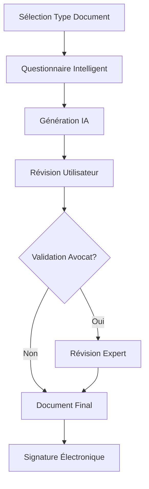

# Fonctionnalités Core - LegalReflex Platform

## 🎯 Vue d'ensemble des Fonctionnalités

La plateforme LegalReflex propose une gamme complète de services juridiques digitaux organisés en modules interconnectés pour offrir une expérience utilisateur fluide et complète.

## 🤖 Module IA Juridique

### Assistant Juridique Intelligent
- **Chat juridique 24/7** avec IA spécialisée en droit français
- **Analyse de documents** automatique avec extraction d'informations clés
- **Résumé de textes juridiques** complexes en langage simple
- **Alertes juridiques** personnalisées selon le profil utilisateur

#### Fonctionnalités Techniques
```javascript
// Exemple d'API pour l'assistant IA
POST /api/ai/legal-chat
{
  "message": "Je veux divorcer, quelles sont mes options ?",
  "context": {
    "userType": "particulier",
    "location": "France",
    "previousContext": []
  }
}

Response:
{
  "response": "En France, vous avez 4 types de divorce possibles...",
  "confidence": 0.92,
  "sources": ["Code civil art. 229", "..."],
  "nextSteps": ["consulter_avocat", "document_divorce"],
  "estimatedCost": "1500-3000€"
}
```

### Analyse Documentaire Avancée
- **OCR juridique** pour numériser et analyser tout document
- **Classification automatique** des types de contrats
- **Détection de clauses** problématiques ou manquantes
- **Comparaison de versions** avec highlighting des modifications

## 👥 Module Gestion Utilisateurs

### Profils Différenciés

#### Particuliers
- **Dashboard personnalisé** avec ses dossiers en cours
- **Historique des consultations** et documents générés
- **Calendrier juridique** avec échéances importantes
- **Centre de notifications** pour les alertes légales

#### Entreprises (PME/TPE)
- **Multi-utilisateurs** avec gestion des droits d'accès
- **Tableau de bord entreprise** avec KPIs juridiques
- **Gestion des contrats** avec dates d'échéance
- **Compliance tracker** selon le secteur d'activité

#### Avocats Partenaires
- **Profil professionnel** vérifié et certifié
- **Gestion de planning** et disponibilités
- **Outils de consultation** vidéo intégrés
- **Dashboard revenus** et statistiques

### Fonctionnalités d'Authentification
- **Connexion sécurisée** avec 2FA obligatoire
- **SSO** avec Google, Microsoft, LinkedIn
- **Vérification d'identité** via FranceConnect
- **Gestion RGPD** complète avec consentements

## 📋 Module Génération de Documents

### Documents Automatisés

#### Particuliers
- **Lettres de mise en demeure** personnalisées
- **Contrats de location** conformes à la loi
- **Testaments** avec assistance juridique
- **Formulaires administratifs** pré-remplis

#### Entreprises
- **Statuts de société** (SARL, SAS, SASU)
- **Contrats de travail** selon conventions collectives
- **CGV/CGU** personnalisées par secteur
- **Contrats commerciaux** (prestation, vente, partenariat)

### Workflow de Génération


### Fonctionnalités Avancées
- **Templates intelligents** qui s'adaptent au contexte
- **Suggestions automatiques** basées sur la jurisprudence
- **Validation juridique** en temps réel
- **Historique des versions** avec système de rollback

## 💬 Module Consultation Juridique

### Types de Consultations

#### Consultation IA (Gratuite/Premium)
- **Réponses instantanées** aux questions juridiques basiques
- **Guidage étape par étape** pour les procédures simples
- **Estimation des coûts** pour les démarches juridiques
- **Orientation** vers les bons interlocuteurs

#### Consultation Avocat (Payante)
- **Vidéoconférence** sécurisée et enregistrée
- **Chat en temps réel** avec prise de notes
- **Partage de documents** durant la consultation
- **Compte-rendu automatique** généré par IA

### Marketplace d'Avocats
- **Profils détaillés** avec spécialisations et avis clients
- **Système de notation** transparent et vérifié
- **Tarification claire** affichée par type de prestation
- **Disponibilités en temps réel** avec réservation instantanée

#### Matching Intelligent
```python
# Algorithme de matching avocat-client
def match_lawyer_client(client_need, client_location, budget):
    lawyers = filter_by_specialization(client_need)
    lawyers = filter_by_location(lawyers, client_location, max_distance=50km)
    lawyers = filter_by_budget(lawyers, budget)
    lawyers = sort_by_rating_and_availability(lawyers)
    return lawyers[:5]  # Top 5 matches
```

## 📊 Module Suivi de Dossiers

### Gestion Complète des Affaires
- **Timeline interactive** de l'évolution du dossier
- **Documents centralisés** avec organisation automatique
- **Notifications automatiques** pour les échéances importantes
- **Collaboration** entre client et avocat en temps réel

### Outils de Productivité
- **Rappels automatiques** pour les démarches à effectuer
- **Templates d'e-mails** juridiques pré-rédigés
- **Calculs automatiques** (délais, intérêts, pénalités)
- **Export PDF** de l'ensemble du dossier

## 💳 Module Paiement & Facturation

### Solutions de Paiement
- **Paiement sécurisé** via Stripe (CB, PayPal, virement)
- **Abonnements** avec gestion automatique des renouvellements
- **Paiement fractionné** pour les gros montants
- **Factures automatiques** conformes à la réglementation

### Gestion Financière
- **Comptabilité intégrée** pour les avocats partenaires
- **Rapports financiers** détaillés
- **Gestion de la TVA** automatique
- **Exports comptables** vers logiciels tiers

## 🔍 Module Recherche Juridique

### Base de Connaissances
- **Veille juridique** automatisée avec résumés IA
- **Jurisprudence** searchable et analysée
- **Textes de loi** à jour avec annotations
- **Formulaires officiels** téléchargeables

### Recherche Intelligente
- **Recherche sémantique** en langage naturel
- **Suggestions automatiques** basées sur le contexte
- **Filtres avancés** par juridiction, date, domaine
- **Alertes personnalisées** sur nouveaux textes

## 📱 Module Mobile & Accessibilité

### Application Mobile
- **App native** iOS/Android avec React Native
- **Synchronisation** temps réel avec la plateforme web
- **Notifications push** pour les échéances importantes
- **Mode hors-ligne** pour consultation des documents

### Accessibilité
- **Interface adaptative** pour malvoyants
- **Navigation vocale** intégrée
- **Contrast élevé** et police ajustable
- **Compatibilité** lecteurs d'écran

## 🔗 Module Intégrations

### APIs Externes
- **Infogreffe** pour données entreprises
- **Service Public** pour démarches administratives
- **Banques** pour vérifications de solvabilité
- **Huissiers** pour significations électroniques

### Webhooks & Automatisations
```javascript
// Exemple de webhook pour nouvelle consultation
POST /webhook/new-consultation
{
  "event": "consultation.created",
  "data": {
    "consultationId": "uuid-123",
    "clientId": "client-456",
    "lawyerId": "lawyer-789",
    "scheduledAt": "2025-11-15T14:00:00Z"
  }
}
```

## 📈 Module Analytics & Reporting

### Dashboard Utilisateur
- **Statistiques d'utilisation** personnalisées
- **Économies réalisées** vs. méthodes traditionnelles
- **Progression des dossiers** avec métriques visuelles
- **Satisfaction** et feedback collecté

### Analytics Avocat
- **Revenus générés** via la plateforme
- **Taux de satisfaction client** et avis détaillés
- **Performance comparative** vs. autres avocats
- **Opportunités d'amélioration** suggérées par IA

## 🛡️ Module Sécurité & Conformité

### Protection des Données
- **Chiffrement end-to-end** pour toutes les communications
- **Audit trail** complet de toutes les actions
- **Backup automatique** avec rétention configurable
- **Conformité RGPD** avec gestion des consentements

### Certifications & Standards
- **ISO 27001** pour la sécurité de l'information
- **Hébergement** agréé données de santé (si applicable)
- **Certification** SecNumCloud de l'ANSSI
- **Audits** de sécurité réguliers par tiers

---

*Spécifications fonctionnelles détaillées - Version 1.0*