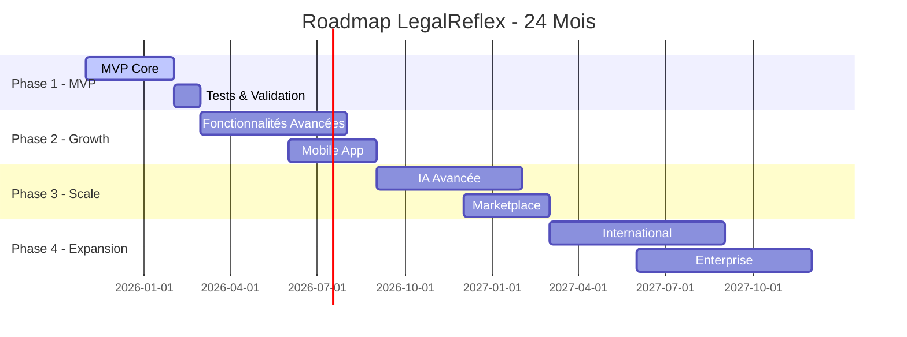

# Roadmap de Développement - LegalReflex Platform

## 🗺️ Vue d'ensemble de la Roadmap

Cette roadmap détaille le développement de la plateforme LegalReflex sur 24 mois, organisée en 4 phases principales avec des milestones clairs et des objectifs mesurables.



## 🚀 Phase 1 : MVP & Validation (Nov 2025 - Mars 2026)

### Objectifs Principaux
- Développer un MVP fonctionnel
- Valider le product-market fit
- Acquérir les premiers 1,000 utilisateurs
- Lever €1.2M en seed funding

### Milestone 1.1 : Core Backend (Nov-Déc 2025)
**Durée :** 6 semaines | **Team :** 3 développeurs

#### Livrables
- [x] Architecture microservices de base
- [x] API Gateway avec authentification JWT
- [x] Service utilisateurs avec CRUD complet
- [x] Base de données PostgreSQL + Redis
- [x] Infrastructure AWS avec CI/CD

#### Spécifications Techniques
```yaml
Services MVP:
  - user-service: Node.js + Express + TypeScript
  - document-service: Python + FastAPI
  - api-gateway: Kong + JWT
  - database: PostgreSQL 14 + Redis 6
  - infrastructure: AWS ECS + RDS + ElastiCache
```

### Milestone 1.2 : Frontend Core (Jan 2026)
**Durée :** 4 semaines | **Team :** 2 développeurs + 1 designer

#### Livrables
- [x] Interface React.js avec TypeScript
- [x] Design system et composants de base
- [x] Pages d'authentification et profil
- [x] Dashboard utilisateur MVP
- [x] Responsive design mobile-first

#### User Stories Prioritaires
1. **Comme utilisateur**, je peux créer un compte et me connecter
2. **Comme utilisateur**, je peux compléter mon profil juridique
3. **Comme utilisateur**, je peux accéder à mon dashboard personnalisé
4. **Comme utilisateur**, je peux naviguer intuitivement dans l'interface

### Milestone 1.3 : IA Juridique Basic (Fév 2026)
**Durée :** 6 semaines | **Team :** 1 data scientist + 1 développeur

#### Livrables
- [x] Chatbot juridique avec OpenAI API
- [x] Base de connaissances juridiques française
- [x] Interface de chat intégrée au frontend
- [x] Système de feedback et amélioration continue

#### Fonctionnalités IA MVP
- Questions-réponses juridiques de base
- Orientation vers les bonnes ressources
- Estimation de coûts pour démarches courantes
- Classification des demandes par domaine juridique

### Milestone 1.4 : Beta Testing (Mars 2026)
**Durée :** 4 semaines | **Team :** Équipe complète

#### Objectifs
- 100 utilisateurs beta testeurs
- Taux de rétention > 40%
- NPS Score > 50
- 95% uptime plateforme

## 📈 Phase 2 : Growth & Features (Mars - Septembre 2026)

### Objectifs Principaux
- Atteindre 5,000 utilisateurs actifs
- Générer €100k ARR
- Lancer l'application mobile
- Intégrer les premiers avocats partenaires

### Milestone 2.1 : Génération de Documents (Mars-Avril 2026)
**Durée :** 8 semaines | **Team :** 2 développeurs + 1 juriste

#### Livrables
- [x] Moteur de génération de documents intelligents
- [x] 20 templates juridiques prioritaires
- [x] Interface de personnalisation intuitive
- [x] Signature électronique intégrée

#### Templates Prioritaires
1. **Particuliers** : Lettre mise en demeure, testament, contrat location
2. **Entreprises** : CGV, contrat travail, statuts SARL/SAS
3. **Immobilier** : Compromis vente, bail commercial

### Milestone 2.2 : Marketplace Avocats v1 (Mai-Juin 2026)
**Durée :** 8 semaines | **Team :** 2 développeurs + 1 business

#### Livrables
- [x] Profils avocats avec vérification identité
- [x] Système de réservation et paiement
- [x] Visioconférence intégrée (Zoom/Teams API)
- [x] 50 avocats partenaires certifiés

#### Fonctionnalités Marketplace
- Recherche et filtrage par spécialité/localisation
- Système de notation et avis clients
- Tarification transparente par type de consultation
- Gestion des disponibilités en temps réel

### Milestone 2.3 : Application Mobile (Juin-Août 2026)
**Durée :** 10 semaines | **Team :** 2 développeurs mobile + 1 designer

#### Livrables
- [x] App iOS/Android avec React Native
- [x] Synchronisation temps réel avec plateforme web
- [x] Notifications push intelligentes
- [x] Interface optimisée mobile

#### Features Mobile Spécifiques
- Scan de documents avec OCR
- Notifications géolocalisées (tribunaux, notaires)
- Mode hors-ligne pour consultation documents
- Intégration calendrier natif

### Milestone 2.4 : Analytics & Optimisation (Sept 2026)
**Durée :** 4 semaines | **Team :** 1 data analyst + 1 développeur

#### Livrables
- [x] Dashboard analytics complet
- [x] Tracking événements utilisateurs
- [x] A/B testing framework
- [x] Optimisation conversion et rétention

## 🔄 Phase 3 : Scale & AI Advanced (Sept 2026 - Mars 2027)

### Objectifs Principaux
- Atteindre 25,000 utilisateurs actifs
- Générer €500k ARR
- IA propriétaire avancée
- Expansion géographique (Belgique)

### Milestone 3.1 : IA Propriétaire (Sept-Nov 2026)
**Durée :** 12 semaines | **Team :** 2 data scientists + 1 ML engineer

#### Livrables
- [x] Modèle NLP spécialisé droit français
- [x] Analyse automatique de contrats
- [x] Détection de clauses problématiques
- [x] Recommandations juridiques personnalisées

#### Spécifications IA Avancée
```python
# Architecture du modèle IA propriétaire
class LegalAI:
    def __init__(self):
        self.nlp_model = CustomBERT(legal_corpus="french_law")
        self.contract_analyzer = ContractAnalyzer()
        self.risk_assessor = RiskAssessment()
        self.recommendation_engine = RecommendationEngine()
    
    def analyze_document(self, document):
        entities = self.nlp_model.extract_entities(document)
        risks = self.risk_assessor.assess(entities)
        recommendations = self.recommendation_engine.generate(risks)
        return {"entities": entities, "risks": risks, "recommendations": recommendations}
```

### Milestone 3.2 : Suivi de Dossiers (Déc 2026 - Jan 2027)
**Durée :** 8 semaines | **Team :** 2 développeurs + 1 UX designer

#### Livrables
- [x] Système complet de gestion de dossiers
- [x] Collaboration avocat-client en temps réel
- [x] Timeline interactive des procédures
- [x] Intégration calendriers externes

### Milestone 3.3 : Recherche Juridique (Fév-Mars 2027)
**Durée :** 6 semaines | **Team :** 1 développeur + 1 data scientist

#### Livrables
- [x] Base de données jurisprudence complète
- [x] Moteur de recherche sémantique
- [x] Veille juridique automatisée
- [x] API publique pour développeurs

## 🌍 Phase 4 : Expansion & Enterprise (Mars - Septembre 2027)

### Objectifs Principaux
- 75,000 utilisateurs actifs
- €2M ARR
- Expansion internationale
- Solution Enterprise

### Milestone 4.1 : Solution Enterprise (Mars-Mai 2027)
**Durée :** 10 semaines | **Team :** 3 développeurs + 1 product manager

#### Livrables
- [x] Multi-tenancy et gestion des organisations
- [x] SSO et intégration LDAP/Active Directory
- [x] Workflows juridiques personnalisables
- [x] Reporting avancé et compliance

### Milestone 4.2 : Expansion Internationale (Juin-Août 2027)
**Durée :** 12 semaines | **Team :** Équipe complète + juristes locaux

#### Livrables
- [x] Adaptation légale Belgique et Luxembourg
- [x] Localisation interface (FR/NL/DE)
- [x] Partenariats avocats locaux
- [x] Conformité réglementaire locale

### Milestone 4.3 : Platform API (Sept 2027)
**Durée :** 6 semaines | **Team :** 2 développeurs + 1 dev advocate

#### Livrables
- [x] API publique complète et documentée
- [x] SDK JavaScript/Python
- [x] Marketplace de plugins
- [x] Programme partenaires développeurs

## 📊 Métriques de Succès par Phase

### Phase 1 - MVP (Mars 2026)
| Métrique | Objectif | Réalisé |
|----------|----------|---------|
| Utilisateurs inscrits | 1,000 | TBD |
| Utilisateurs actifs | 400 | TBD |
| Taux de rétention J30 | 30% | TBD |
| NPS Score | 50+ | TBD |
| Uptime plateforme | 95% | TBD |

### Phase 2 - Growth (Sept 2026)
| Métrique | Objectif | Réalisé |
|----------|----------|---------|
| Utilisateurs actifs | 5,000 | TBD |
| ARR | €100k | TBD |
| Avocats partenaires | 100 | TBD |
| Documents générés | 1,000/mois | TBD |
| Mobile downloads | 2,000 | TBD |

### Phase 3 - Scale (Mars 2027)
| Métrique | Objectif | Réalisé |
|----------|----------|---------|
| Utilisateurs actifs | 25,000 | TBD |
| ARR | €500k | TBD |
| Précision IA | 85% | TBD |
| Taux conversion | 15% | TBD |
| Expansion Belgique | 500 users | TBD |

### Phase 4 - Expansion (Sept 2027)
| Métrique | Objectif | Réalisé |
|----------|----------|---------|
| Utilisateurs actifs | 75,000 | TBD |
| ARR | €2M | TBD |
| Clients Enterprise | 50 | TBD |
| Pays actifs | 3 | TBD |
| API calls/mois | 100k | TBD |

## 🚨 Risques et Contingences

### Risques Techniques
- **Retard développement IA** → Plan B : Utilisation APIs externes
- **Problèmes scalabilité** → Migration cloud progressive
- **Bugs critiques** → Rollback automatique + hotfixes

### Risques Business
- **Adoption lente** → Pivot vers B2B enterprise
- **Concurrence agressive** → Accélération roadmap
- **Réglementation** → Adaptation rapide avec conseil juridique

### Risques Équipe
- **Recrutement difficile** → Télétravail + salaires compétitifs
- **Turnover élevé** → Stock options + culture d'entreprise
- **Manque compétences** → Formation continue + consultants

## 🎯 Prochaines Étapes Immédiates

### Semaine 1-2
- [x] Setup équipe de développement
- [x] Configuration environnement de développement
- [x] Sprint planning détaillé Phase 1
- [x] Validation architecture avec CTO

### Semaine 3-4
- [ ] Développement API Gateway
- [ ] Configuration base de données
- [ ] Premier prototype interface utilisateur
- [ ] Tests sécurité préliminaires

### Mois 2
- [ ] MVP service utilisateurs
- [ ] Interface d'authentification
- [ ] Premiers tests utilisateurs
- [ ] Préparation demo investisseurs

---

*Roadmap Version 1.0 - Mise à jour hebdomadaire*

**Responsable Produit :** [À définir]  
**Dernière Révision :** Novembre 2025  
**Prochaine Révision :** Décembre 2025